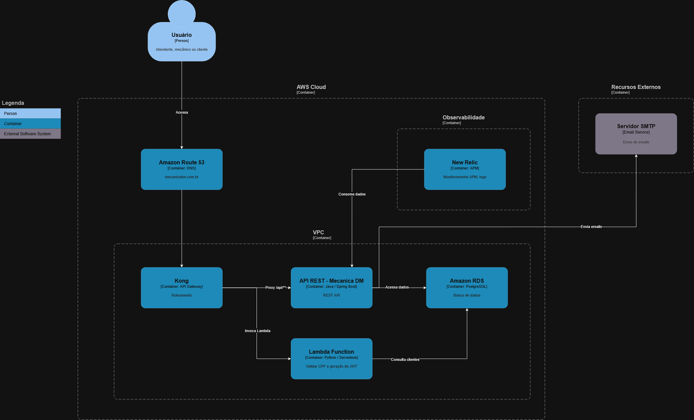
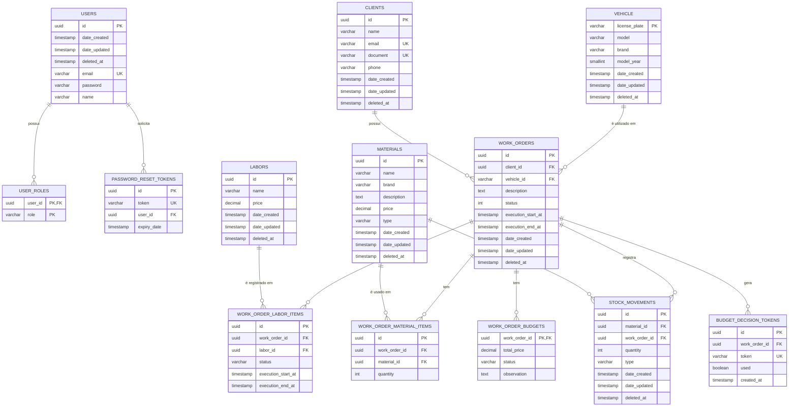
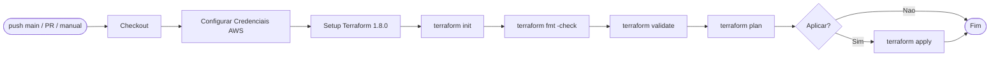
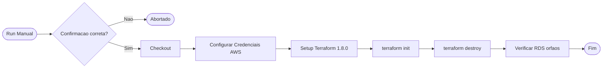

# Mecânica DM - Gerenciamento Banco de Dados (Terraform)

Infrastructure as Code (IaC) para provisionamento e gerenciamento da camada de banco de dados PostgreSQL do sistema **Mecânica DM** na AWS.

Este repositório é parte do ecossistema **Mecânica DM v3**, responsável exclusivamente pela infraestrutura de banco de dados. A camada de aplicação (EKS, VPC, Lambda) é gerenciada pelo repositório [`mecanicadm-k8s-v3`](https://github.com/mecanica-dm/mecanicadm-k8s-v3).

## Documentação

### Componenetes de infraestrutura



### Diagrama de Entidade-Relacionamento

[Link para imagem do diagrama](docs/assets/erd-mecanicadm.png)



## Como Usar

### 1. Inicializar o Terraform

```bash
terraform init \
  -backend-config="bucket=<seu-bucket>" \
  -backend-config="key=mecanicadm-db-v3/terraform.tfstate" \
  -backend-config="region=us-east-1"
```

### 2. Planejar as mudanças

```bash
terraform plan -out=tfplan-prod
```

### 3. Aplicar as mudanças

```bash
terraform apply tfplan-prod
```

### 4. Destruir a infraestrutura

> ⚠️ **Atenção**: Utilize apenas quando necessário. A destruição remove todos os recursos e dados do banco.

```bash
terraform destroy
```

Ou utilize o workflow manual `destroy.yml` no GitHub Actions (requer digitar `DESTRUIR` como confirmação).

## CI/CD

### Pipeline Principal (`ci-cd.yml`)

Disparado em pushes para `main`, Pull Requests e dispatch manual:



### Workflow de Destruição (`destroy.yml`)

Disparado apenas manualmente (`workflow_dispatch`):



## Stack / Pré-requisitos

- [Terraform](https://www.terraform.io/downloads.html) >= 1.5.0
- [AWS CLI](https://docs.aws.amazon.com/cli/latest/userguide/getting-started-install.html) configurado com credenciais válidas
- Acesso à AWS com permissões para criar recursos RDS, SSM, Secrets Manager, IAM, EC2 (Security Groups)
- O repositório [`mecanicadm-k8s-v3`](https://github.com/mecanica-dm/mecanicadm-k8s-v3) deve ter sido aplicado primeiro (fornece VPC, subnets e Security Groups via SSM)
